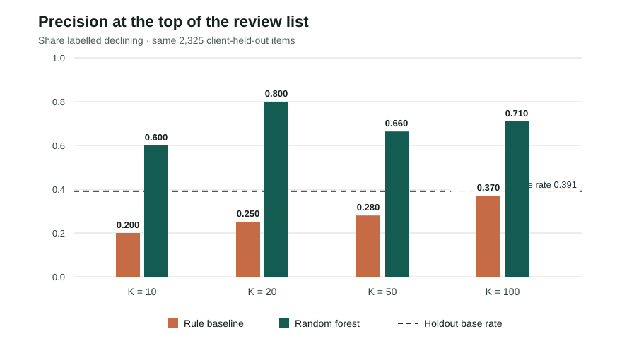
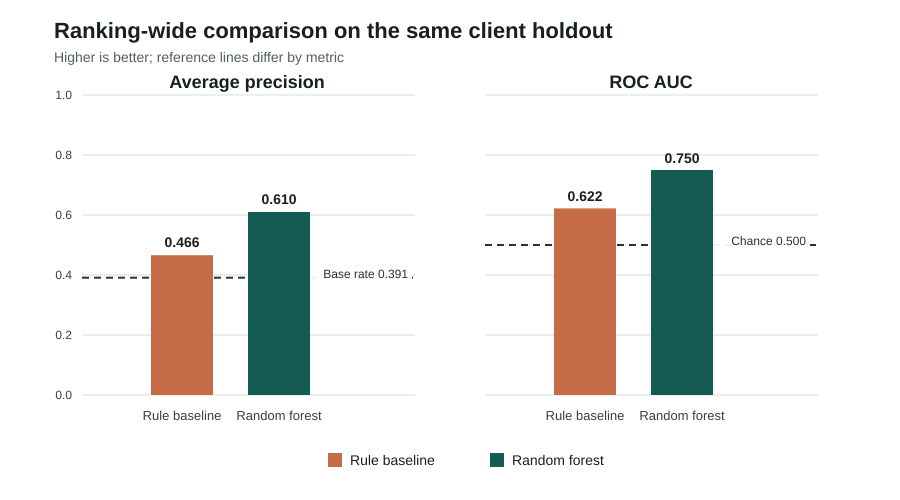

# Which Pages Should an Editor Review First?

## A client-held-out content review ranking on an anonymized starter snapshot

**Author:** Himanshu Sharma  
**Study date:** 2026-10-02  
**Study type:** Descriptive model development and one client-grouped holdout evaluation

## Abstract

FlyRank's content-refresh opportunity lane asks which pages to review first for refresh, expansion, protection, pruning, or monitoring when editorial capacity is limited. I use the bundled 30,000-row, 44-column anonymized starter snapshot covering 32 pseudonymized clients, with a proxy label for recent impression decline. A random-forest ranker is compared with a transparent rule on the same fixed-seed, client-grouped holdout, excluding IDs and label-defining fields from model features. On 2,325 held-out items from six clients, model Precision@50 is 0.660 versus 0.280 for the rule and a 0.391 label prevalence. This supports ordering human review for this snapshot and proxy target; it is not a future decline forecast or evidence that a refresh causes recovery.

## Introduction / Problem Statement

This case study addresses FlyRank's content-refresh opportunity lane: from a portfolio of pages, which should an editor review first for refresh, expansion, protection, pruning, or monitoring? The practical tension is limited review capacity: a recent search-performance decline can identify an item for inspection, but does not by itself say which intervention is appropriate. I operationalize the lane's review-first decision as whether a compact ranking places more proxy-labelled declines in the first 50 slots than a transparent freshness-and-visibility rule.

On the anonymized starter snapshot, the random forest reached 0.660 Precision@50 versus 0.280 for the rule on one client-held-out split (base rate 0.391). That result is evidence about ranking this proxy label for review, not proof those pages need a refresh. The dataset contains no editorial outcomes or treatment comparison, so the system can order human attention but cannot choose an intervention or claim that a change will recover traffic.

## Data

The analysis uses `data/raw/content_refresh_anonymized.csv`, the bundled FlyRank internship starter export: 30,000 content-item rows, 44 source columns, and 32 pseudonymized clients. One row represents one content item. It is a single snapshot, not a daily warehouse table. Its activity features aggregate a trailing 90-day window ending at export time; the export contains no calendar extraction date, so no calendar date range is claimed.

The proxy label compares impressions in the most recent 30 days with impressions in the previous 30 days. `trend_direction == "down"` means the recent window is more than 20% lower. The export contains no page titles, URLs, domains, client names, or raw search queries. It has 30,000 unique content IDs, no duplicate IDs, no zero-impression rows, and no items younger than 90 days; this capstone applies no further row filtering.

This is **not** the separate 78,835,655-row warehouse release described elsewhere in the repository. No warehouse tables or partitions were queried for these results. The results and claims below are limited to the starter CSV and the notebook run documented here.

Identifiers are used only for deduplication and client-group splitting. The feature frame excludes `content_id`, `client_id`, `is_declining_label`, `trend_direction`, `trend_pct`, the explicit recent/previous 30-day comparison fields, and the baseline score. Provider/model metadata is not part of this feature set. The last/previous-window fields define or overlap the target; IDs could encode identity or client membership; and the baseline is a comparator, not a predictor. Although the explicit comparison fields are excluded, trailing-90-day activity features still overlap the recent-30-day label window, as discussed under Limitations.

## Methodology

### Target and assumptions

The target is the observed snapshot proxy `is_declining_label = (trend_direction == "down")`. It is not a future-month event. The analysis assumes that this proxy is useful for illustrating a review-ordering workflow on this snapshot; it does not assume that a labelled decline is recoverable or that any refresh will change the outcome.

### Features and model

The random forest uses 18 numeric and eight categorical fields. Numeric inputs: `search_volume`, `competition`, `cpc`, `word_count`, `char_count`, `impressions_90d`, `clicks_90d`, `sessions_90d`, `ai_sessions_90d`, `days_with_impressions`, `days_with_sessions`, `content_age_days`, `days_since_last_update`, `ctr`, `avg_position`, `engagement_rate`, `scroll_rate`, and `ai_traffic_pct`. Categorical inputs: `competition_level`, `content_type`, `main_intent`, `age_tier`, `freshness_tier`, `word_count_tier`, `impression_tier`, and `position_tier`.

Numeric missing values are imputed with training-set medians and missingness indicators; categorical missing values use the most frequent training value, followed by one-hot encoding. The classifier is `RandomForestClassifier` with 100 trees, maximum depth 10, minimum leaf size 25, balanced subsampling, and random seed 42. Scores are used to order the queue; calibration was not evaluated.

### Baseline

The transparent rule combines four percentile-ranked signals, calculated over the full snapshot: visibility (40%), update age (30%), position opportunity (25%), and content-depth gap (5%). It is scored on exactly the same held-out rows as the random forest. The baseline is intentionally simple, operationally legible, and not presented as an optimized competitor.

### Validation and leakage checks

A fixed-seed 20% client holdout was used: six complete clients (2,325 items) were held out, with 27,675 items for training. No client or content ID overlapped across the client-grouped boundary. The same test rows and target are used for the rule baseline, the model, and the reported base rate. A stratified row split is coded only as a fallback if a group split cannot contain both target classes; it was not used in this run.

The notebook asserts that IDs, the label and its source fields, explicit 30-day comparison fields, and the baseline score are not model features. These checks prevent direct label-column leakage and client overlap. They do not fix the temporal overlap between trailing-90-day activity features and the recent-30-day proxy label.

### Metrics

Precision@K is the proportion labelled declining within the top K ranked items. Precision@50 is the primary measure because the motivating review budget is 50. Average precision summarizes ranking quality over the full holdout; ROC AUC measures pairwise discrimination. The held-out prevalence is included as the random-selection reference.

## Results

On the same 2,325 held-out items, the model's Precision@50 is **0.660**, compared with **0.280** for the rule baseline and **0.391** for random selection at the holdout base rate. That is 33 labelled items in the model's first 50 versus 14 in the rule's first 50, on this one split. Average precision is 0.610 versus 0.466; ROC AUC is 0.750 versus 0.622.

| Method | Precision@10 | Precision@20 | Precision@50 | Precision@100 | Average precision | ROC AUC |
|---|---:|---:|---:|---:|---:|---:|
| Expected under random selection | 0.391 | 0.391 | 0.391 | 0.391 | — | — |
| Transparent rule baseline | 0.200 | 0.250 | 0.280 | 0.370 | 0.466 | 0.622 |
| Random forest | 0.600 | 0.800 | 0.660 | 0.710 | 0.610 | 0.750 |

**Figure 1.** Precision at four review budgets. At K=50, the random forest is 0.660 and the rule baseline is 0.280; the dashed reference is the 0.391 holdout prevalence. The table above provides the same values without relying on color or image perception.

**Figure 2.** Ranking-wide metrics on the same holdout. Average precision is compared with the target prevalence; ROC AUC is compared with chance-level discrimination. The panels use separate reference lines because the metrics have different interpretations.

The model exceeds the rule and the random-selection reference on the selected metrics in this run. This is an observed difference on one client holdout, not an estimate of expected performance across future clients or months.

## Limitations & Honest Framing

- The study uses the 30,000-row starter snapshot, not the 78.8-million-row warehouse release. It has no calendar extraction date.
- The target is a current snapshot proxy derived from recent-versus-prior impressions, not a future outcome.
- Trailing-90-day features overlap the recent-30-day label window. Excluding `trend_direction`, `trend_pct`, and explicit comparison fields prevents direct target-field leakage but does not provide temporal separation.
- The grouped holdout contains six clients and is one fixed split. There are no repeated-fold uncertainty estimates or a time-forward test; client composition can materially affect the result.
- The baseline uses full-snapshot percentile ranks, suitable to rank a known batch but not evidence of a frozen, independently calibrated production baseline.
- Model scores are not calibrated. Editorial labor, business value, refresh effects, and causal outcomes are unmeasured.
- The export covers only the content and instrumentation present in this starter slice. Missing or absent signals do not imply low quality or no opportunity.

The defensible claim is narrow: **on this fixed client-held-out split of the starter snapshot, the random forest ranked the proxy label above the rule baseline at K=50 and on the reported ranking metrics.** It does not show that the model will generalize to new time periods, that a page will continue to decline, or that an editorial change will improve performance.

## Ranked Recommendations

1. **Pilot the ordering with a human reviewer and a fixed small batch.** The observed top-50 comparison supports testing the random-forest order against the rule; it does not warrant automated edits. Record accepts, rejects, overrides, and time spent.
2. **Verify stale, visible candidates before allocating substantive work.** The playbook flags items with at least 500 trailing-90-day impressions and 180 or more days since update. Check current status, intent, and recent edits first.
3. **Inspect search-intent and snippet context for low-CTR candidates.** The review rule requires at least 500 impressions, a recorded average position from 1 through 20, and CTR below 0.5 percentage points. It prompts inspection, not an automatic rewrite.
4. **Use measured engagement as a secondary page-experience check.** With at least 30 sessions, a positive engagement or scroll rate below 30% is a review cue. Zero or missing measurement is not evidence of poor experience.
5. **Monitor or improve measurement when no strong signal is present.** “Monitor or measure” is not a healthy-page label. Compare human outcomes with the rule baseline before expanding the pilot.

The held-out queue's aggregate action counts are: `monitor_or_measure` 1,650; `review_snippet_and_search_intent` 227; `audit_snippet_and_position` 212; `refresh_fact_check_and_prioritize` 187; `review_page_experience` 47; and `review_content_experience` 2. Thresholds and action names are workflow hypotheses, not calibrated risk bands or measured ROI. Every item remains subject to human review.

## Reproducibility

Run from the repository root:

1. Install packages: `python -m pip install -r requirements.txt`.
2. Open `work/notebooks/capstone.ipynb` in VS Code or Jupyter and run all cells from a fresh kernel.
3. Confirm the aggregate metrics receipt at `work/outputs/w08_capstone_metrics.json`, the canonical SVG figures under `work/figures/`, and their Pages copies under `docs/paper/assets/`.

The notebook fixes random seed 42 and records Python 3.13.15, pandas 3.0.0, NumPy 2.4.2, and scikit-learn 1.8.0 for this run. It writes aggregate metrics and figures only; it does not export a row-level queue. Reproduction uses the bundled anonymized starter CSV and does not require gated warehouse access.

- Repository: [Flyrank-ml--internship](https://github.com/HimanshuSharma-2856/Flyrank-ml--internship)
- Notebook: [work/notebooks/capstone.ipynb](notebooks/capstone.ipynb)
- Metrics receipt: [work/outputs/w08_capstone_metrics.json](outputs/w08_capstone_metrics.json)

## Acknowledgments & Data Credit

Built on the [FlyRank ML Internship dataset](https://flyrank.ai/). The separate warehouse release is not the data source for the results in this paper.

## Reporting and Design References

- Collins GS, Moons KGM, Dhiman P, et al. TRIPOD+AI statement: updated guidance for reporting clinical prediction models that use regression or machine learning methods. *BMJ*. 2024;385:e078378. [doi:10.1136/bmj-2023-078378](https://www.bmj.com/content/385/bmj-2023-078378). Used as a reporting checklist for accurate abstracts, evaluation details, limitations, and open materials; it is not a domain-specific quality standard for this non-clinical study.
- NeurIPS. [Paper Checklist Guidelines](https://neurips.cc/public/guides/PaperChecklist). Used to check claim scope, limitations, and reproducibility details.
- Google. [Rules of Machine Learning](https://developers.google.com/machine-learning/guides/rules-of-ml). Supports starting with a measurable baseline and evaluating the metric that matches the review decision.
- W3C Web Accessibility Initiative. [Reflow (WCAG 2.2, SC 1.4.10)](https://www.w3.org/WAI/WCAG22/Understanding/reflow.html), [Complex Images](https://www.w3.org/WAI/tutorials/images/complex/), and [Page Structure Tutorial](https://www.w3.org/WAI/tutorials/page-structure/). Informed the responsive single-column layout, semantic section structure, chart descriptions, and adjacent text/table equivalents.
