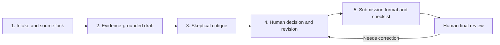

# Week 5 - Draft, Critique, Revise Workflow

## Pipeline choice

I chose **draft, critique, revise** from my workflow audit. My recurring work is not just
collecting information. I need to turn a research question, notebook output, or evidence file
into public-safe writing without losing the boundary between what I measured and what I am merely
hypothesizing.

The workflow runs in a Claude Project named `FlyRank Content Archetype Portfolio`. It uses the
existing FlyRank repository files as its source material. It is no-code: I add one new input to the
Project, paste the intake prompt, and pass each output to the next prompt.

## Flow sketch

### Handoffs

1. **Intake and source lock:** identify the new input, its purpose, audience, and allowed source
   files. Handoff: a short source ledger and a list of claims that need evidence.
2. **Evidence-grounded draft:** write a first draft using only the source ledger. Handoff: draft
   with claim labels such as observed, measured, directional, or decision-support.
3. **Skeptical critique:** look for unsupported claims, missing numbers, privacy risks, and rubric
   gaps. Handoff: an issue list with exact repairs.
4. **Human decision and revision:** I accept, reject, or alter each proposed repair, then ask for a
   revised draft. Handoff: a version I can explain and own.
5. **Submission format and checklist:** compress the approved version into the requested format
   and check every deliverable requirement. Handoff: final artifact plus unresolved human checks.

## Claude Project configuration

I would paste these instructions into the Project once:

> I am a FlyRank ML internship learner working on structured content-archetype analysis. Help me
> turn repository evidence into clear, public-safe writing. Use only the files and outputs I provide
> for factual claims. Never invent metrics, clients, screenshots, sources, account actions, or
> personal experience. Label claims as observed, measured, directional, hypothesis, or
> decision-support when useful. Preserve privacy: do not repeat client names, private queries,
> domains, URLs, credentials, or raw sensitive data. My research direction, interpretation, ethical
> boundaries, and final wording remain mine to decide. For every draft, return: (1) the draft, (2)
> a source ledger mapping important claims to files or outputs, and (3) open questions. For every
> critique, rank issues by risk and propose the smallest repair. Do not silently change the data
> source, time window, label, feature definition, or audience.

### Prompt 1 - Intake and source lock

> New input: [attach or paste one repository artifact]. Intended output: [notebook section,
> portfolio copy, or submission]. Audience: [audience]. Read the input and create a source ledger.
> Separate observed facts, measured results, interpretations, hypotheses, and missing evidence.
> Quote no private data. End with the three claims that a draft may safely make and the questions I
> must answer myself.

### Prompt 2 - Evidence-grounded draft

> Using only the source ledger and attached source files, draft the requested artifact for the
> stated audience. Keep the evidence boundary visible. Do not add a number, causal claim, client
> detail, or tool action that is not in the sources. Include a short source ledger after the draft.

### Prompt 3 - Skeptical critique

> Review this draft against the source files and the stated purpose. Find unsupported or overly
> strong claims, missing evidence, privacy risks, unclear handoffs, and rubric gaps. Return a table
> with severity, exact text, why it is a problem, and the smallest repair. If a proposed repair
> needs a fact that is not present, mark it as a human task instead of inventing it.

### Prompt 4 - Human-approved revision

> I accept these critique items: [list]. I reject or defer these items: [list]. Revise the draft
> accordingly. Preserve my accepted evidence boundary and do not resolve deferred questions by
> guessing. Return the revised artifact and a short change log.

### Prompt 5 - Submission format

> Format the approved artifact for this deliverable: [paste rubric]. Check each requirement as
> pass, missing, or human verification required. Keep the writing concise. Return the final copy,
> the checklist, and a separate list of screenshots, links, or account actions I still need to
> supply. Do not claim that an external action happened unless I supplied evidence for it.

## Five real runs

These runs use real files already in this repository. The output excerpts below are the useful
handoffs produced for the next step; they are deliberately concise rather than pretending to be
verbatim external chat transcripts.

### Run 1 - Research question framing

- Input: [framed_cases.md](framed_cases.md)
- Purpose: turn the content-archetype idea into a decision-ready case description
- Draft output: “A content strategist or editor can use observable page structure to organize a
  large page portfolio into interpretable groups, sample an archetype, and decide what deserves
  review first.”
- Critique output: avoid implying that grouping improves rankings or automatically prescribes a
  rewrite; name the human review step.
- Revised handoff: “The output is descriptive decision support, not proof that a cluster causes
  better search performance.”
- Human check: confirm that the actor, operational cost, and claim boundary match the intended
  portfolio audience.

### Run 2 - Data contract explanation

- Input: [w03_data_contract.ipynb](notebooks/w03_data_contract.ipynb)
- Purpose: create readable explanation of scope and leakage protections
- Draft output: “Development uses the March 2026 partition, while the sealed June 2026 sample is
  not used for label logic.”
- Critique output: the statement must remain tied to the notebook’s executed checks; do not call
  the split causal or generalize beyond the available partition.
- Revised handoff: a short scope paragraph followed by links to the notebook assertions and the
  row-grain definition.
- Human check: run the notebook and verify the displayed dates and assertions before publishing.

### Run 3 - Feature and leakage review

- Input: [w03_feature_leakage_check.ipynb](notebooks/w03_feature_leakage_check.ipynb)
- Purpose: explain why a feature is allowed or rejected
- Draft output: “A feature is acceptable only when it is available at the stated decision point and
  does not encode the future outcome.”
- Critique output: distinguish a mechanical leakage check from proof that the final model will
  generalize.
- Revised handoff: “The check reduces one identified leakage risk; it does not establish causal
  validity or production performance.”
- Human check: inspect the feature list and confirm the decision-time assumption is real.

### Run 4 - Workflow audit summary

- Input: [ai_fluency_workflow_audit.md](ai_fluency_workflow_audit.md)
- Purpose: write a concise account of what AI may do and what remains human-owned
- Draft output: “AI can draft, organize, explain, and check work; I retain responsibility for
  problem choice, sensitive judgment, evidence, and final submission.”
- Critique output: include concrete review actions rather than saying “human in the loop” without
  defining it.
- Revised handoff: a checklist requiring source tracing, privacy review, claim review, notebook
  execution, and final submission review.
- Human check: confirm that the checklist describes actions I actually performed, not intentions.

### Run 5 - Stack decision formatting

- Input: [week04_stack_decision.md](week04_stack_decision.md)
- Purpose: format a decision with alternatives and trade-offs for submission
- Draft output: three options: plain HTML/CSS on GitHub Pages, a no-code builder, and React/Next.js
  on Vercel.
- Critique output: every option must state hosting, backend need, fit for evidence, and maintenance
  cost; the chosen option must be justified in first person.
- Revised handoff: plain HTML/CSS on GitHub Pages, with no backend yet, because it shows long-form
  case studies, charts, screenshots, and repository links while remaining maintainable.
- Human check: confirm the chosen stack matches the actual live project and do not submit a URL
  until it returns the page rather than a 404.

## Timing comparison

I have not run a verified external stopwatch in this workspace, so these are estimates to test in
the first live Claude Project session rather than fabricated measurements.

| Activity | One manual pass | Pipeline setup/use | Notes |
| --- | ---: | ---: | --- |
| First run, including Project setup | 35 min | 50 min | Setup is an upfront cost and is slower than manual work once |
| Runs 2-5 after setup | 30 min each | 12 min each | Includes source lock, draft, critique, revision, and format |
| Five-run total | 150 min | 98 min | Estimated saving: 52 min after including setup |
| Break-even | n/a | after about 2 runs | The prompts and instructions are reusable |

The honest comparison is not “AI is always faster.” The first run loses time to setup, source
selection, and fixing prompt boundaries. The gain appears when the same review pattern is repeated
and the source ledger prevents me from rereading every file from scratch.

## Failure points and required human review

- **Wrong source or stale output:** the Project may use an older notebook or draft. Human check:
  confirm the exact file and execution state before accepting a claim.
- **Fluent overclaiming:** a draft may turn correlation or a descriptive pattern into a causal
  promise. Human check: compare every strong verb with the actual evidence.
- **Missing decision-time assumptions:** leakage review can sound complete while leaving a feature’s
  availability unresolved. Human check: inspect the feature definition and decision point.
- **Privacy leakage:** pasted source material may contain more detail than the public artifact needs.
  Human check: remove client names, raw queries, domains, credentials, and identifying screenshots.
- **False completion:** the workflow can format a URL, screenshot, or account task without proving
  it happened. Human check: open the URL, run the notebook, and attach authentic evidence.
- **Prompt drift:** after several turns, the model may start optimizing for polished prose instead
  of the original question. Human check: restate the audience, purpose, and allowed sources at each
  new run.

The workflow is therefore assistive, not autonomous. It is working end to end when a brand-new
source file can pass through all five handoffs and produce a traceable draft, a critique, a revision,
and a submission checklist without inventing evidence.